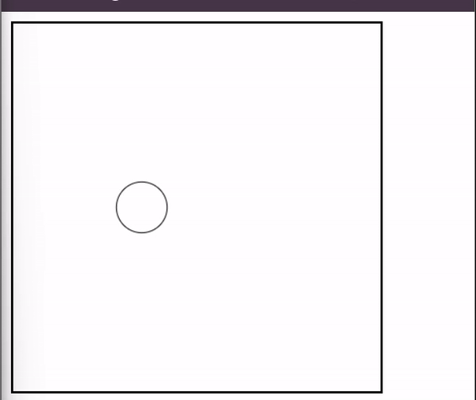
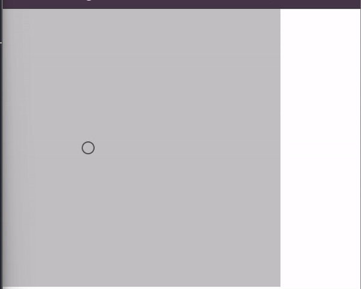
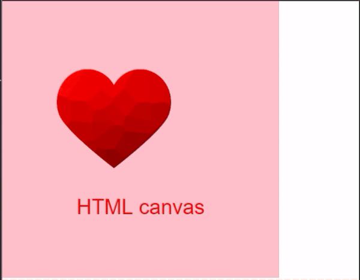
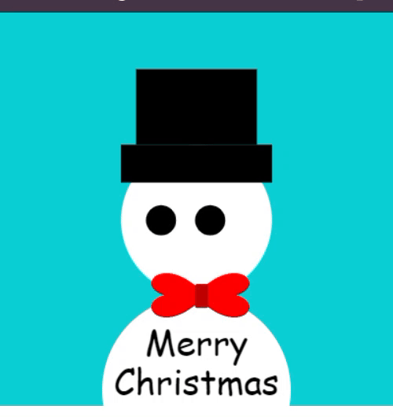
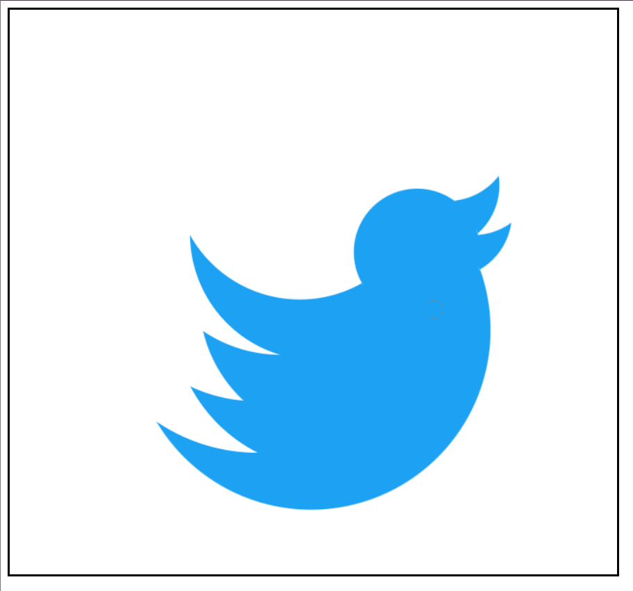

<h3>
Output 1: Snow Man
</h3>

<h3>
Output 2: Animation Circle
</h3>

<h3>
Output 3: Mouse Pointer Animation
</h3>

<h3>
Output 4: Heart Image Animation 
</h3>

<h3>
Output 5: Snow Man Eye Animation
</h3>

<h3>
Output 6: Illusion Wall
</h3>

<h3>
Output 7: Draw Yin Yang
</h3>

<h3>
Output 7: Ebbinghaus Illusion
</h3>

<h3>
Output 7: Oscar Illusion
</h3>

<h3>
Output 8: Twitter Logo
</h3>

